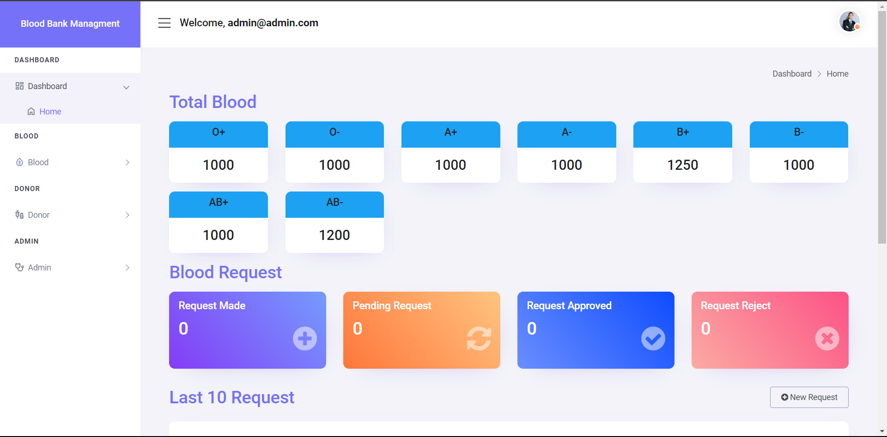
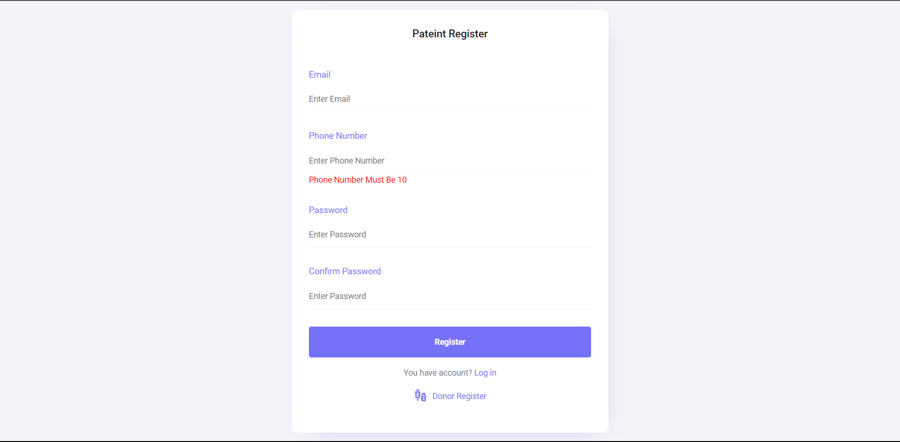
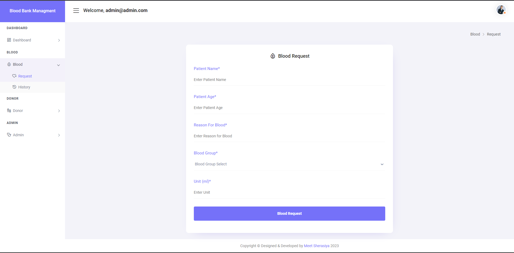
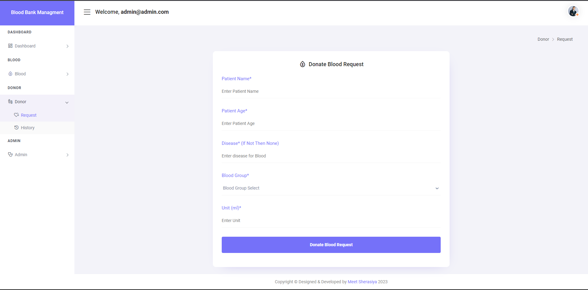
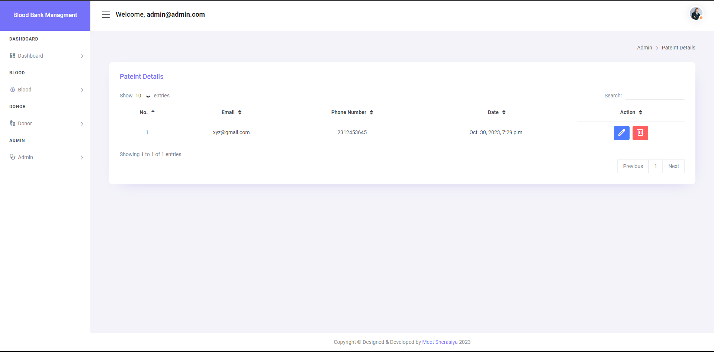
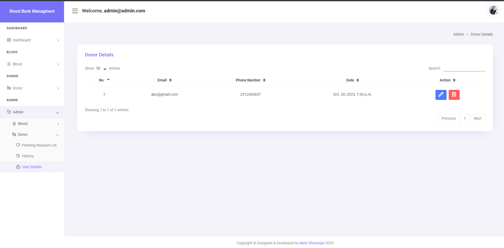

# Bloodbank_Managment_System

# Key Features:

1. User Registration and Authentication:
Users can register with the system.
Authentication mechanisms to ensure secure access.

2. User Roles:
Differentiate between regular users, donors, and administrators.

3. User Dashboard:
Overview of previous donation history and pending requests.

4. Blood Donation:
Donors can submit details about their blood donation.
Track and display a history of donations for each donor.

5. Blood Request:
Users can create requests for specific blood types.
Admins can approve or reject requests.

6. Admin Dashboard:
Access to a centralized dashboard for administrators.
Overview of pending blood requests, donations, and available blood units.

7. Blood Inventory Management:
Admins can manage and update the inventory of available blood units.
Track expiration dates of blood units.


## Setup

The first thing to do is to clone the repository:

```sh
$ git clone https://github.com/MeetSherasiya/Bloodbank_Managment_System.git
$ cd Bloodbank_Managment_System
```

Create a virtual environment to install dependencies in and activate it:

```sh
$ virtualenv --no-site-packages env
$ source env/bin/activate
```

Then install the dependencies:

```sh
(env)$ pip install -r requirements.txt
```
Note the `(env)` in front of the prompt. This indicates that this terminal
session operates in a virtual environment set up by `virtualenv`.

Once `pip` has finished downloading the dependencies:
```sh
(env)$ cd laundry_managment_system
(env)$ python manage.py runserver
```

## Login Credentials For Admin Access

Email : admin@admin.com<br>
Password : admin@1234

# Software Pages Screenshot

## Dashboard Page



## Patient Login Page



## Donor Login Page


## Patient Request Page



## Donor Request Page



## Patient Details Page



## Donor Details Page

